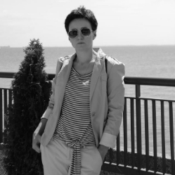

# Vera Kuzniatsova
### Web developer

---


### CONTACT INFORMATION

**Phone:** +48 572 256 573<br>
**E-mail:** verakuzniatsova20@gmail.com<br>
**Telegram:** @vera_kuzniatsova<br>
**Discord:** verak27<br>
[Dribbble](https://dribbble.com/Vera-K)<br>
[Tilda](https://verakuzniatsova.tilda.ws/en)

---

## BRIEFLY ABOUT MYSELF

I am Vera Kuzniatsova, a UX/UI design enthusiast and Web developer at the start of my career with a complex medical background and with passion for the latest solutions and interactive design. I focus on making digital experiences more enjoyable and accessible.

I have skills in working on the GetCourse platform, UX/UI design, web design in Adobe Photoshop, Figma, Canva, neural networks for image generation.

I create websites using Tilda, HTML and CSS, combining marketing, design and development.

## LANGUAGES
* Russian and Belarusian (native speaker)
* English (B1) 
* Polish (B2)

## SKILLS
* UX/UI Design: Adobe Photoshop, Figma, Canva
* Web Development: HTML, CSS, Tilda
* Tools: Git, Slack
* Technical support for webinars: Bizon365, Zoom, YouTube, OBS Studio, Preparation of autowebinars
* GetCourse: Preparing mailings for invitations and reminders
* Learning platforms: Organization of online courses in Telegram, VKontakte, GetCourse
* Programme for electronic textbook creation: SunRav Book Office
* Proficiency in using the remote work applications: Zoom, Google Meet, etc


## EDUCATION
* 1994 - 2000, Grodno State Medical University - Specialty: General Medicine
* 2000 - 2003, PhD Course, Histology, Cytology and Embryology Department, Grodno State Medical University
* 2004  Doctor of Philosophy Degree in Biology is awarded (PhD, Biology)
* 2024 Maria Lebedeva’s online school “Administration of Online Schools”
* 2024 Olga Chernova’s online school of UI/UX design ITlogia 

## DESIGN PROJECTS

Prototypes, website design concepts, landing pages, mood boards, longreads, etc. are presented in the portfolio on the platforms Dribble, Instagram, Telegram, Behance. 
Created a comprehensive portfolio website to showcase my design and development projects.

## PREVIOUS WORK EXPERIENCE

20 years of scientific and teaching experience **Grodno State Medical University**:

* 2013   Associate Professor • Histology, Cytology and Embryology Department • Grodno State Medical University
* 2011 - 2013 Senior Lecturer • Histology, Cytology and Embryology Department • Grodno State Medical University
* 2003 - 2004 Junior Research Scientist • Central Scientific Research Laboratory • Grodno State Medical University
* 2001 - 2011 Assistant • Histology, Cytology and Embryology Department • Grodno State Medical University

Author of 52 scientific, educational and methodological publications, of which: 2 patents, 2 reference guides, 12 articles in scientific journals (2 in the USA), 15 articles and 21 theses in conference works collections, 8 electronic educational and methodological complexes (2 of which are electronic academic publications “Histology, Cytology and Embryology for the Students of the Medical Faculty” and “EMMC HISTOLOGY, CYTOLOGY, EMBRYOLOGY for the International Students of the Medical Faculty” with the seal of the Ministry of Education of the Republic of Belarus).

## MAIN PUBLICATIONS 

1. Zimatkin, S.M., Fedina, E.M., Kuznetsova, V.B. Histaminergic Neurons in the Rat Brain after Acute Exposure to Alcohol // Neuroscience and Behavioral Physiology. 2013. Vol. 43, T. 6. P. 691-696.
2. Zimatkin, S.M., Kuznetsova, V.B., Strik, O.N. Spatial organization and morphometric characteristics of histaminergic neurons in the rat brain // Neuroscience and Behavioral Physiology. 2006. Vol. 36, T. 5. P. 467-471.

## AWARDS 

* Elsevier  International Prize Laureate - Scopus Award Belarus 2013 in the category “Young Scientists in Medicine”
* Certificates of Honour of Grodno State Medical University

## LEADERSHIP
Laureate of the Elsevier International Prize - Scopus Award Belarus 2013 in the category “Young Scientists in Medicine”. Number one in practical implementation of information technology in the academic process among the universities of the Republic of Belarus, well-deserved authority with students and colleagues, as well as remarkable professionalism, comprehensive knowledge and high standards.

## PERSONAL QUALITIES
- Dependable
- Determined
- Initiative
- Versatile

## CODE EXAMPLE

```javascript
function multiply(a, b){
  return a * b;
}
```
---
